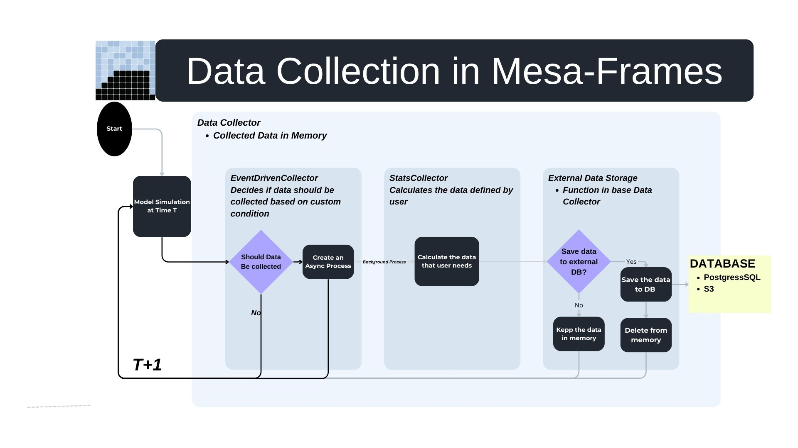

# Data Collection Module for Mesa- Frames - Final Report GSoC 2025

## Context
[Project Mesa](https://github.com/projectmesa) Mesa is an open-source Python library for agent-based modeling, ideal for simulating complex systems and exploring emergent behaviors.

[Mesa-Frames](https://github.com/projectmesa/mesa-frames) extends Mesa to support large-scale simulations with thousands or even millions of agents. By storing agents in a DataFrame, Mesa-Frames enables vectorized operations, leading to significant improvements in scalability and computational efficiency, particularly when multiple agents are activated simultaneously.

However, Mesa-Frames originally lacked a data collection module, which led to several difficulties for researchers. For example, data could only be accessed once a simulation had fully completed, making real-time analysis impossible. In addition, failures during execution often resulted in partial or complete loss of valuable data. These were among the issues that motivated the development of a dedicated data collection system in this project.


## GSoC 2025 Goals
The primary objective of this project was to implement a **robust and flexible data collection system for Mesa-Frames** with the following features:  
- **Multiple storage backends** (local files, cloud, and databases).  
- **Model- and agent-level collection** to support both global and granular perspectives.  
- **Event-driven collection**, ensuring only relevant data is gathered, thereby reducing overhead.  



## Usage Example  

A minimal usage example showing how to use the new `DataCollector`:  

```python
from mesa_frames import ModelDF, AgentsDF
from mesa_frames.concrete.datacollector import DataCollector
import polars as pl

# Example agent set with 1 agent
class ExampleAgentSet1(AgentsDF):
    def __init__(self, model: ModelDF):
        super().__init__(model)
        self["wealth"] = pl.Series("wealth", [5])   # one agent with wealth=5
        self["age"] = pl.Series("age", [10])        # one agent with age=10

    def step(self):
        self["wealth"] += 1
        self["age"] += 1

# Model using the agent set
class ExampleModel(ModelDF):
    def __init__(self):
        super().__init__()
        self.agents = ExampleAgentSet1(self)

    def step(self):
        self.agents.step()

# Initialize model + DataCollector
model = ExampleModel()
model.dc = DataCollector(
    model=model,
    model_reporters={"total_wealth": lambda m: m.agents["wealth"].sum()},
    agent_reporters={"wealth": "wealth", "age": "age"},
    storage="csv",
    storage_uri="./data"
)

# Run 3 steps with collection
for _ in range(3):
    model.step()
    model.dc.collect()

# Flush collected data to disk
model.dc.flush()
```

This example:  
- Tracks model-level stats (`total_agents`).  
- Tracks agent-level stats (`wealth`,`age`).  
- Stores results as CSVs on disk (`./data`).  
---

## Performance Benchmarking  

We benchmarked different data collection + flushing strategies on the **Boltzmann Wealth Model (100 steps)** with up to **1M agents**.  
The goal was to evaluate trade-offs between **execution time**, **memory usage**, and **CPU utilization**.  

### Strategies Compared  
- **mesa-frames (pl native)**: baseline run without data collection.  
- **Every step → CSV (immediate flush)**.  
- **Every 10th step → CSV (immediate flush)**.  
- **Every step → In-memory only**.  
- **Every step → Deferred flush (100 steps, one-by-one files)**.  
- **Every step → Deferred flush (100 steps, concatenated)**.  
- **Every step → Parquet flush**.  
- **Every step → Async flush**.  

### Results  

#### Execution Time  
- **Async Flush** was the fastest while still persisting data.  
- **Every step CSV** was the slowest due to constant I/O.  
- **In-memory only** nearly matched the baseline, confirming file writes as the main bottleneck.  

#### Memory Usage  
- **Async Flush** and **Deferred Flush (concatenated)** used the most memory.  
- All strategies showed a memory dip around ~700k agents (seen consistently in tests).  

#### CPU Utilization  
- **Async Flush** kept the CPU busy (no idle time).  
- **Deferred flush** left CPU underutilized.  

### Plots  

  
  
  

### ✅ Conclusion  
The chosen default is:  

➡️ **`mesa-frames (pl native) with data collector – Async Flush`**  

Despite higher memory usage, it provides:  
- **Best runtime performance**  
- **Efficient CPU utilization**  
- **Scalability to millions of agents**  

---


## Contributions :
1. [Abstract Data Collector [PR]](https://github.com/projectmesa/mesa-frames/pull/156) 
    - Defined a standardized interface for collecting model- and agent-level data.  
    - Added support for reporter functions, conditional triggers, and asynchronous flushing.  
    - Established pluggable storage backends (memory, CSV, Parquet, S3, PostgreSQL) as extension points.  

2. [Concrete Data Collector [PR]](https://github.com/projectmesa/mesa-frames/pull/161) 
    - Collected data via lazy Polars pipelines for efficiency.  
    - Supported immediate and conditional collection for both model and agent data.  
    - Added persistence to local (CSV/Parquet), cloud (S3), and database (PostgreSQL) backends.  
    - Provided validation for inputs and schema integration for PostgreSQL.  
3. [Benchmarking Datacollector implementation [discussion]](https://github.com/projectmesa/mesa-frames/discussions/168)
   - Benchmarked flush strategies (CSV, Parquet, memory, deferred, async) on Boltzmann Wealth Model (1M agents).  
   - Identified file writes as the main bottleneck.  
   - **Async Flush** chosen as default: fastest runtime + best CPU use, at cost of higher memory.  

4. [Data Collector Enhancements [PR] (WIP)](https://github.com/projectmesa/mesa-frames/pull/167) 
    - Introduced **async flushing** to remove I/O bottlenecks and safely handle race conditions.  
    - Supported **multiple collects per step** by batching collections. 
    - Improved Code structure and Quality as well as introduced test cases


## Future Work
- Extend and refine documentation for broader adoption.  
- Test the data collector with additional, diverse Mesa-Frames examples.  
- Incorporate further edge-case testing to guarantee reliability under extreme conditions.  


## Challenges
The most demanding aspect of the project lay in **design decisions rather than coding**. Considerable time was invested in comparing alternative architectures and selecting the most efficient and scalable solutions.  


## Acknowledgement
- [Adam](https://github.com/adamamer20) for collaborating on the design discussions and contributing to the decision-making process, which helped shape the data collector into a more robust and scalable module.